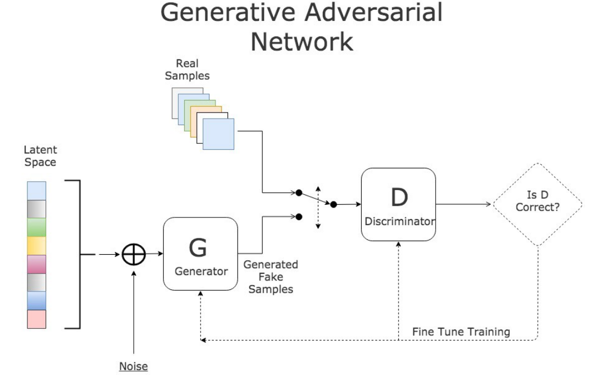

# GAN

**Generative Models
ITMO University, Autumn 2022, MSc course**

The author of the project structure and mentore by Arip Asadulaev & Manh Lab ITMO

In 2014, Ian Goodfellow and his colleagues at the University of Montreal published a stunning paper introducing the world to GANs, or generative adversarial networks. The models play two 
distinct (literally, adversarial) roles. Given some real data set $\chi$, 𝐺 is the generator, trying to create fake data that looks just like the genuine data, while  𝐷 is the discriminator, 
getting data from either the real set or 𝐺 and labeling the difference.

Goodfellow’s metaphor (and a fine one it is) was that  𝐺 was like a team of forgers trying to match real paintings with their output, while  𝐷 was the team of detectives trying to tell the 
difference. (Except in this case, the forgers 𝐺 never get to see the original data — only the judgments of 𝐷. They’re like blind forgers.)

*Gans structure:*

In this part, we are going to implement classical GAN. You can find a rough plan on how to do it below:

* Define the parameters
* Load the data (with transforms and normalization)
* Denormalize for visual inspection of samples
* Define the Discriminator network, the Generator network
* Study the activation function: Leaky ReLU
* Explain the output activation function: Tanh, Sigmoid
* Look at some sample outputs
* Define losses, optimizers and helper functions for training
  - For Discriminator
  - For Generator
* Train the model
* Save intermediate generated images to file
* Look at some outputs
* Save the models
