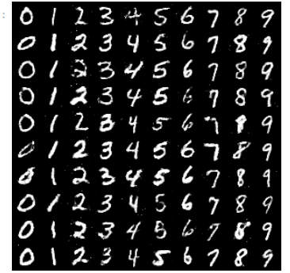

# Conditional GAN

**Generative Models
ITMO University, Autumn 2022, MSc course**

My mentor and the author of the structure of the work is Arip Asadulaev & Manh Lab ITMO

*The assignment for this project:*

Let's continue our dive into the classical generative models! Today's goal is to implement Conditional GAN for the MNIST dataset. There will be no particular instructions how to do it (just a 
few checkpoints) - feel free to rewrite this skeleton or reuse your code from the previous assignment ([Assignment 1](https://github.com/1rmu/ITMO/tree/main/GANs/Assignment%201)).

*My results:*

The discrimator loss and generator loss:

The accuracy of discrimator:

The generated image after 300 epochs of learning:

