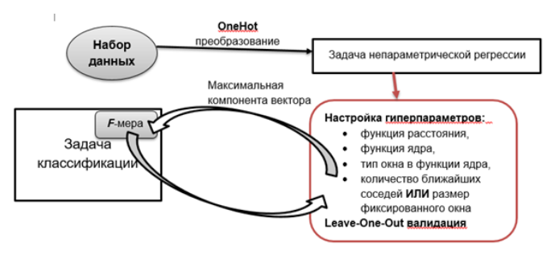

# Непараметрическая регрессия

Целями данной работы являлись:
* Получение первичных навыков обработки данных: нормализация, One-Hot преобразование;
* Сведение задачи классификации к задаче непараметрической регрессии;
* Реализация решения задачи непараметрической регрессии ядерным сглаживанием Надарая Ватсона;
* Настройка и анализ гиперпараметров модели, решающей задачу непараметрической регрессии.

*Набор данных*

Для решения задачи классификации в качестве набора данных был взят следующий набор: [Сar](https://www.openml.org/d/40975)

1. Сведение к задаче регрессии и обработка данных  
От задачи классификации я перешел к задаче регрессии, используя OneHot преобразование. Вместо одного целевого признака в наборе данных добавил столько новых числовых переменных, сколько в нём 
содержится классов. Нечисловые признаки были векторизированы (перешел от категорий к числам), заполнил пропуски и нормализировал.

2. Реализация алгоритма и настройка гиперпараметров, анализ результатов  
Был реализован алгоритм решения задачи непараметрической регрессии при помощи ядерного сглаживания Надарая-Ватсона. 

3. Далее искал лучшую комбинацию гиперпараметров алгоритма непараметрической регрессии среди:
   * функция расстояния:
      - расстояние Евклида,
      - расстояние Манхэттена, 
      - расстояние Чебышева;
  * функиця ядра:
    - uniform: $K(u)=\frac{1}{2}$;
    - triangular: $K(u)=(1-|u|)$;
    - epanechnikov: $K(u)=\frac{3}{4}(1-u^{2})$;
    - quartic: $K(u)=\frac{15}{16}(1-u^{2})^2$.
  * по типу окна (окно, зависящее от числа соседей или фиксированное):
    - число ближайших соседей от 1 до $\sqrt{|D|}$, |D| - размер набора данных, $\sqrt{|D|}$ является эвристикой на число ближайших соседей для метрических алгоритмов
    - фиксированный размер окна, его необходимо выбирать исходя из “размеров” набора данных; хорошей практикой является настройка ширины окна на отрезке $[\frac{R(D)}{\sqrt{|D|}}; R(D)]$ с шагом $\frac{R(D)}{\sqrt{|D|}}; R(D)$, где R(D) - самое большое расстояние между элементами в наборе данных.

Таким образом, следует перебрать $24\sqrt{|D|}$ комбинаций гиперпараметров и найти лучшую. Для настройки алгоритма была использована Leave-One-Out перекрёстная проверка.

Критерием качества являлась F-мера. Для её подсчёта потребовалось определить максимальную компоненту результирующего вектора целевых признаков, полученных из One-Hot преобразования, после применения очередной конфигурации алгоритма непараметрической регрессии (алгоритм с одной из комбинаций гиперпараметров).
Для лучшей найденной комбинации гиперпараметров был построен графики зависимости F-меры от числа ближайших соседей.

*Схема работы:*

