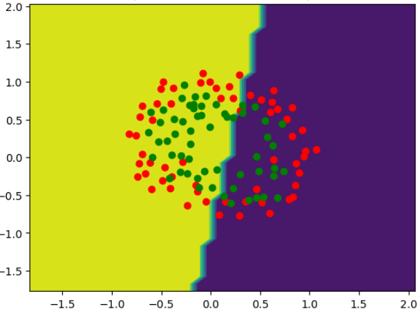
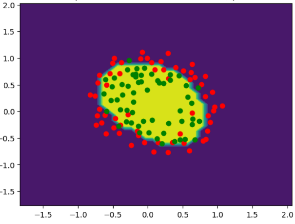
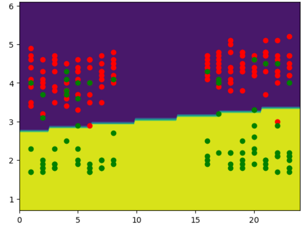
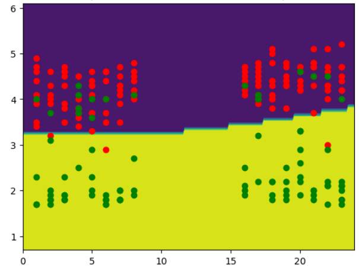
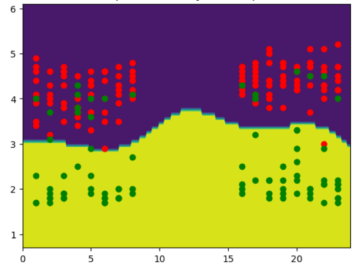

# Метод опорных векторов

Целями данной работы являлись:
* реализовать метод опорных векторов;
* настроить гиперпараметры: параметр ядра и коэффициент опорных векторов;
* проанализ результаты.

*Набор данных*

Для тестирования классификатора были использованы наборы данных: chips.csv (определение брака при производстве микрочипов) и geyser.csv (данные об извержении Йеллоустонского вулкана).

*Алгорит и его настройка*

Был реализован метод опорных векторов и три ядра для него:
* линейное ядро;
* полиномиальное ядро со степенью;
* гауссово ядро с радиальной базисной функцией.

Для каждого набора данных и ядра найдены лучшие гиперпараметры ядра: степень полинома для полиномиального ядра {2, 3, 4, 5} и $\beta=[1,..., 5]$ для гауссова ядра $K(x,y)=\exp(-\beta||x-y||^2)$,
а также ограничения на коэффициенты опорных векторов C=[0.05, 0.1, 0.5, 1.0, 5.0, 10.0, 50.0, 100.0].

Для выбора наилучших параметров была использована точность (accuracy), посчитанная при перекрёстной проверке.

После нахождения оптимальных параметров для каждого набора данных и ядра была выведена найденная точность, гиперпараметры алгоритма, при которых она была достигнута.

*Результаты*

Для каждого набора данных и каждого ядра были нарисован, как реализованный алгоритм (с лучшими прочими гиперпараметрами) работает в исходном пространстве. Для изображения классификатор  
обучался на всём наборе данных, тестовым множеством в этом случае было всё пространство.

*Применение линейного ядра на наборе данных chips.csv*

*Применение полиномиального ядра на наборе данных chips.csv*

*Применение гауссова ядра на наборе данных chips.csv*

*Применение линейного ядра на наборе данных geyser.csv*

*Применение полиномиального ядра на наборе данных geyser.csv*

*Применение гауссова ядра на наборе данных geyser.csv*

