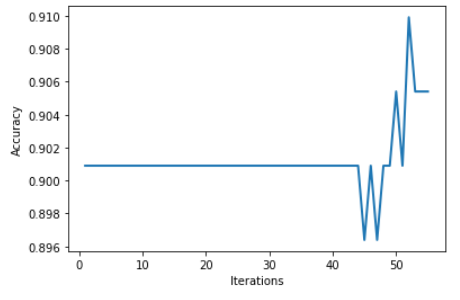
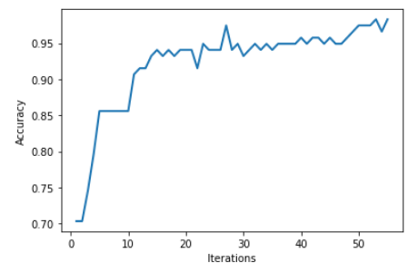

# Композиция алгоритмов

Целью данной работы было изучение способов построения композиций алгоритмов машинного обучения.

В рамках работы был реализован алгоритм построения решающего дерева по взвешенным объектам.

*Набор данных*

Для тестирования и визуализации полученных алгоритмов были использованы датасеты chips.csv (определение брака при производстве микрочипов) и geyser.csv (данные об извержении Йеллоустонского 
вулкана).

*Случайный лес*

Реализован алгоритм построения случайного леса решающих деревьев на случайных подмножествах объектов. Высоты деревьев не были ограничены.

*Бустинг*

Реализован алгоритм AdaBoost на решающих деревьях ограниченной малой высоты (не более 3).

Были приведены изображения, как алгоритм классифицирует всё пространство после 1, 2, 3, 5, 8, 13, 21, 34 и 55 шага бустинга, построены графики зависимости качества (accuracy) от номера шага.

*График зависимости точности от номера шага для датасета Geyse*

*График зависимости точности от номера шага для датасета Chips*

