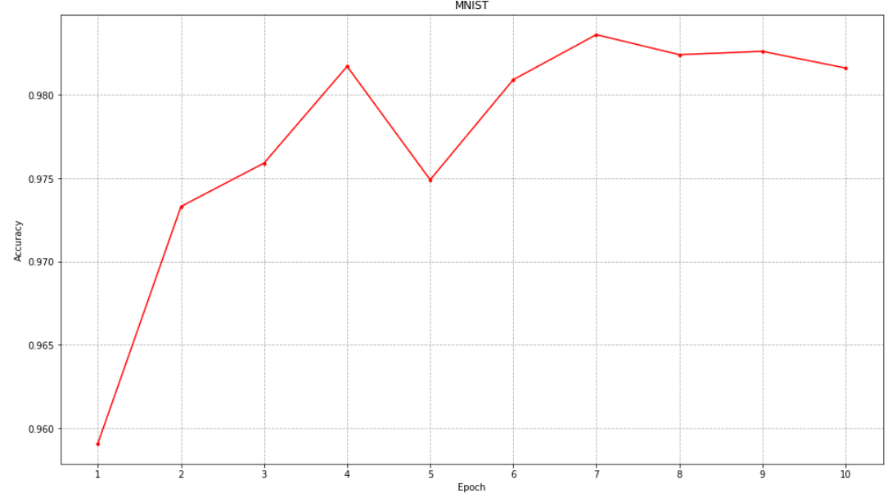
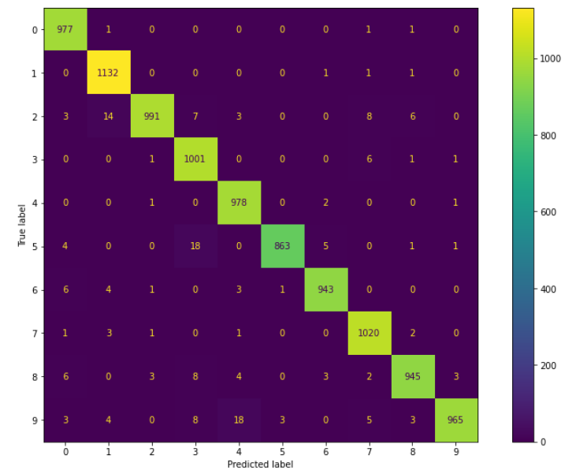
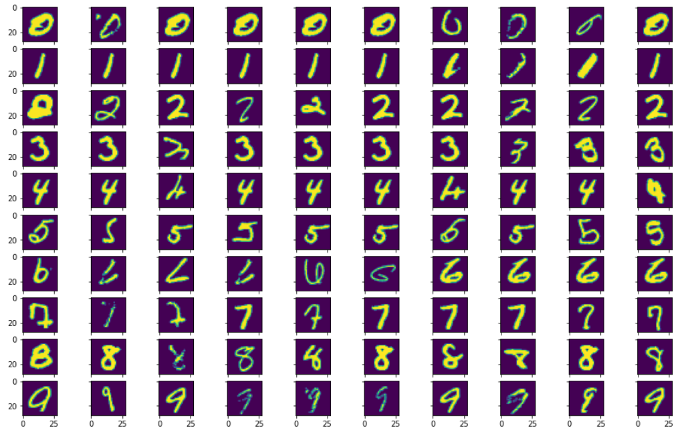
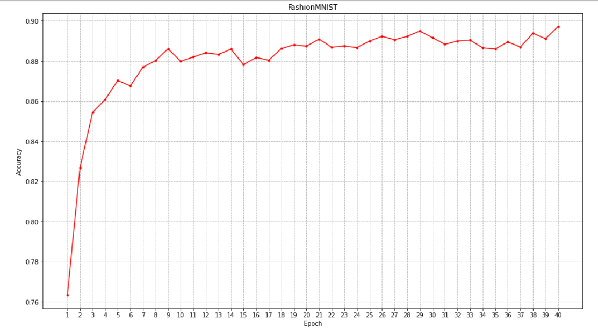
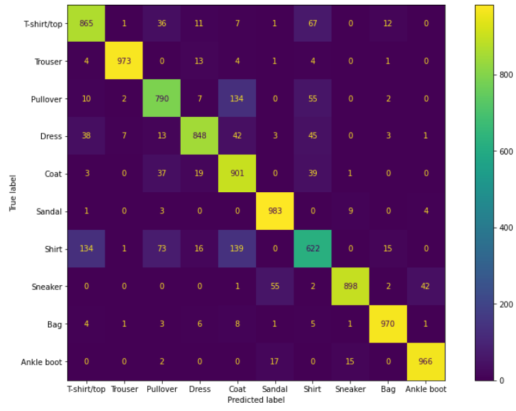
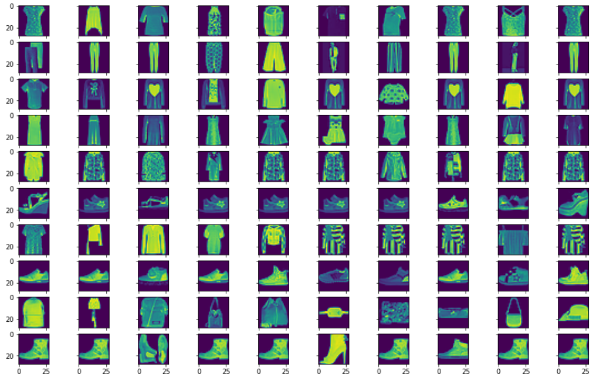

# Свёрточная сеть

Целью работы было постройка сверточной нейронной сети и проведение экспериментов на наборе данных.

Была построена свёрточная “нейронная” сеть, состоящая из последовательности преобразований свёртки и пулинга. Вывод сети завершается SoftArgMax преобразованием. Была найдена наилучшая
архитектура сети. Для поиска параметров был использован один из методов адаптивного градиентного спуска.  
В качестве минимизируемой функции ошибки была использована перекрёстная энтропия, а в качестве контрольной функции ошибки - Accuracy (Error Rate).   
Была построена обыкновенная матрица неточностей, а также матрица, у которой в ячейке i,j находится изображение класса i, которое сеть посчитала наиболее похожим на класс j.  

*График Accuracy от количества эпох. MNIST*

*Матрица неточнностей. MNIST*

*Матрица схожих элементов. MNIST*

*График Accuracy от количества эпох. Fashion-MNIST*

*Матрица неточнностей. Fashion-MNIST*

*Матрица схожих элементов. Fashion-MNIST*

